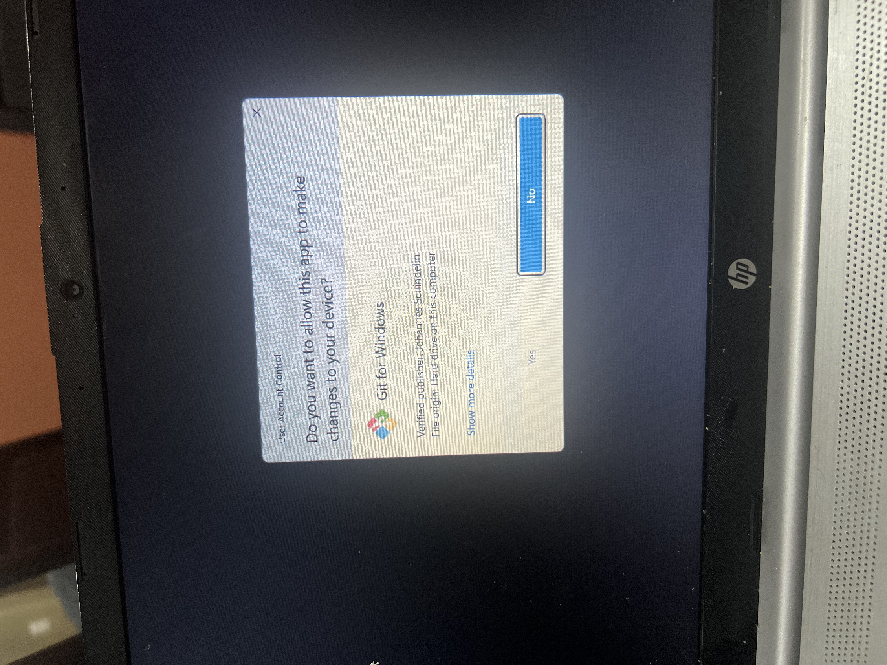
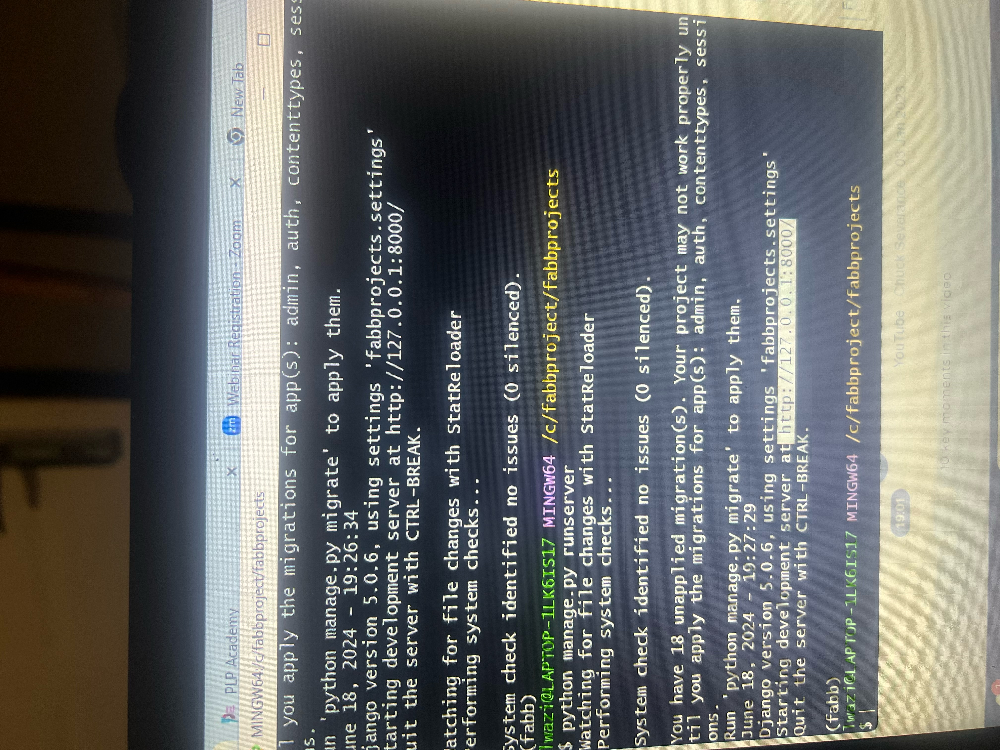
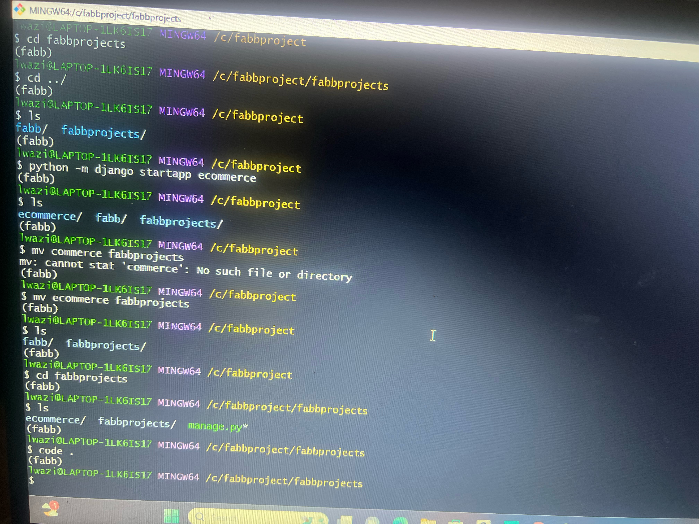
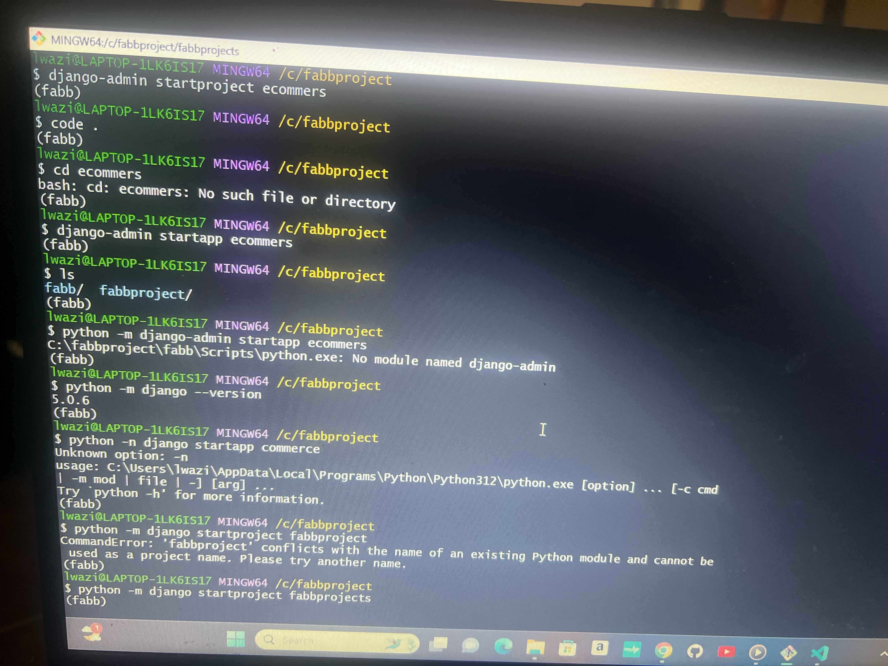
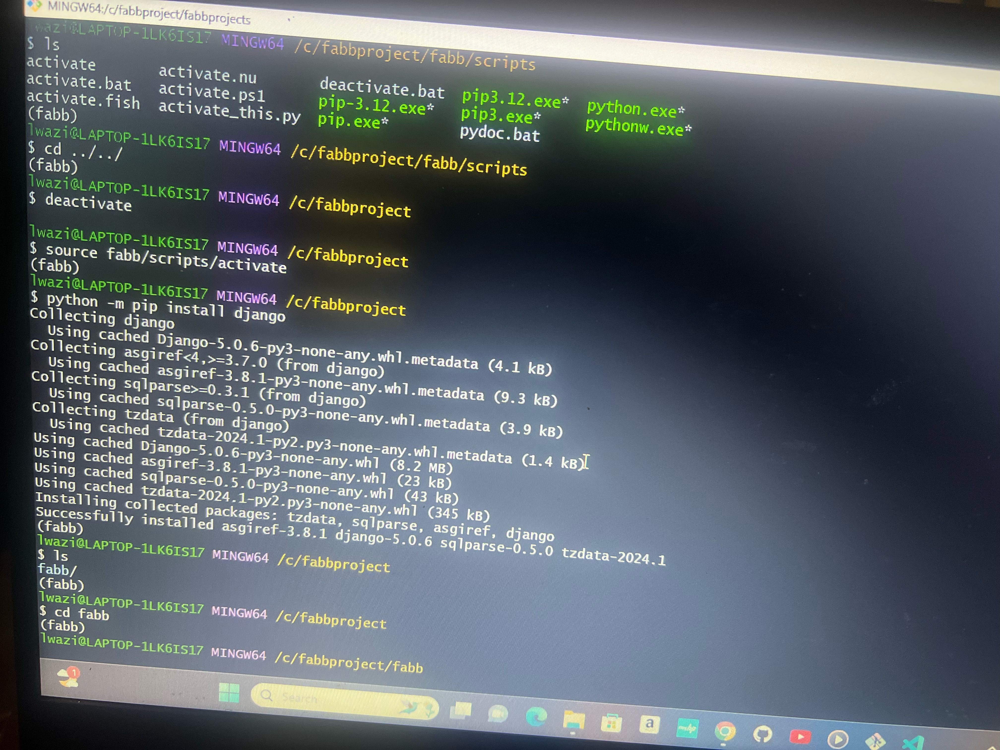

# Dev_Setup
Setup Development Environment

#Assignment: Setting Up Your Developer Environment

#Objective:
This assignment aims to familiarize you with the tools and configurations necessary to set up an efficient developer environment for software engineering projects. Completing this assignment will give you the skills required to set up a robust and productive workspace conducive to coding, debugging, version control, and collaboration.

#Tasks:

1. Select Your Operating System (OS):
   Choose an operating system that best suits your preferences and project requirements. Download and Install Windows 11. https://www.microsoft.com/software-download/windows11
    
    Microsoft comes with the pc by default so I do not need to download or install it.

2. Install a Text Editor or Integrated Development Environment (IDE):
   Select and install a text editor or IDE suitable for your programming languages and workflow. Download and Install Visual Studio Code. https://code.visualstudio.com/Download

   VISUAL STUDIOS

   When downloading and installing visual studios you:

   *go on code.visualstudios.com/download
   *choose your computer, for me it is windows 10/11
   *wait for it to download
   *open visual studios
   *get a user account control notice and click "yes"
   *agree to terms and conditions
   *click 'next' twice
   *under additional task tick all the boxed then 'next'
   *install
   *finish
   *choose development environment on welcome screen
   ** check on launch box to launch

3. Set Up Version Control System:
   Install Git and configure it on your local machine. Create a GitHub account for hosting your repositories. Initialize a Git repository for your project and make your first commit. https://github.com

   GIT

   *go on explora
   *type git
   *click on the second tab and download git
   *go back
   *click on the first tab and clicked on ''click here to download''
   *open downloads
   *open git
   *get account control notice and click 'yes'
   *on information click 'next' then 'next'
   *on the next page check on 'additional icons'
   *next till you reach the default editor choose 'notepad as Git's default editor'
   *next until the end and let it install
   *finish

   CREATING AN ACCOUNT FOR GITHUB

   *go on search bar
   *type github
   *enter the first tab
   *sign up
   *when done signing up
   
   CREATING A GIT REPOSITORIES

   *go on gitbash
   *run as an administrator
   *link git to gitbhas bytyping (git config --global user.name "name") *on the next line (git config --global user.email "email")
   *make sure you put the email put on github
   *type cd c:/ or desktop or wherever you want your file to be
   *type mkdir name of file/directory
   *type cd name of file/directory
   *go on github
   *create new repository
   *give it a name
   *make it public (if needed)
   *click 'create repository'
   *go back to gitbash
   *type git init
   *type git status to check the status
   *go to the folder you created and add a text
   *go back to git
   *type git add name of text.txt
   *type git commit "commit message"
   *type git branch
   *go back to github
   *copy the HTTPS
   *type git remote add origin then paste
   *type git push
   *change main to master if must
   *go on github and refresh

4. Install Necessary Programming Languages and Runtimes:
  Instal Python from http://wwww.python.org programming language required for your project and install their respective compilers, interpreters, or runtimes. Ensure you have the necessary tools to build and execute your code.

INSTALLING PYTHON

*www.python.org
*3click on download
*go to where it is downloaded
*open python
*pop up will appear to install
*click on 'add python to path'
*click on 'install'
*click 'next'
*install
*go to command prompt once it is done installing
*check if installation was successful ('python --version')

PROBLEMS FACED
-I had already installed python so it was the second time and I had forgotten but once remembered deleted both and started afresh.

5. Install Package Managers:
   If applicable, install package managers like pip (Python).

   *pip comes as a default whe installing python
   *install pylance and python debugger on VS Code to do so click shif+ctrl+x on VS code to open extentions and download
   *install matplotlib
   *python -m pip install matplotlib on git

6. Configure a Database (MySQL):
   Download and install MySQL database. https://dev.mysql.com/downloads/windows/installer/5.7.html

TO INSTALL MYSQL

   *go on browser
   *go on mysql
   *download by choosing 'windows(x86, 32-bits,mysql installer 8:0.37 296.1M)'
   *next click on 'no thank just start my download'
   *get account conrol notice and click 'yes'
   *choosing a set up typ -server only then next
   path conflicts -next
   *installation -execute then next
   *product configuration -next
   *shared memory boxes - development computer server
   *tick show advanced and loggin options
   *next
   *authentication method -next
   *account and roles - create a passwor
   *next
   *window service - use the default
   *next
   *advanced options -next
   *loggin options- tick on slow query log and binary log
   *next
   *apply configuration - apply
   *execute
   *finish
   *go to command prompt
   *type this command to initiate your server (c:/program files\mysql sever 8.0\bin\mysql --console)
   *next type (c:/program files mysql\mysql server 8.0\bin\mysqladmin) -u root shutdown

to access mysql on mechine go to computer and search mysql and go to command line client and run as an administrator and enter the password.
on command prompt
*mysql -u root -p
*enter password 
done

7. Set Up Development Environments and Virtualization (Optional):
   Consider using virtualization tools like Docker or virtual machines to isolate project dependencies and ensure consistent environments across different machines.

8. Explore Extensions and Plugins:
   Explore available extensions, plugins, and add-ons for your chosen text editor or IDE to enhance functionality, such as syntax highlighting, linting, code formatting, and version control integration.

9. Document Your Setup:
    Create a comprehensive document outlining the steps you've taken to set up your developer environment. Include any configurations, customizations, or troubleshooting steps encountered during the process. 

    *go on gitbash
    cd c:/
    mkdir fabbproject
    cd fabbproject
    pytho --version
    python -m virtualenv fabb
    source fabb/scripts/activate
    python -m pip instal django
    python -m django startproject fabbprojects
    python -m django startapp ecommerce
    code .
    *go on VS Code 
    settings on the project
    add your app 
    go back to gitbash
    type in
    python manage.py runserver
    ctrl+c to disturb it
    copy the http
    open browser and paste it 
    then enter
    thats how a project is done 

    Ran to a long problem not finding manage.py as ia was using the command django-admin startproject until i changed it to python -m django startproject

#Deliverables:
- Document detailing the setup process with step-by-step instructions and screenshots where necessary.
- A GitHub repository containing a sample project initialized with Git and any necessary configuration files (e.g., .gitignore).
- A reflection on the challenges faced during setup and strategies employed to overcome them.

#Submission:
Submit your document and GitHub repository link through the designated platform or email to the instructor by the specified deadline.

#Evaluation Criteria:**
- Completeness and accuracy of setup documentation.
- Effectiveness of version control implementation.
- Appropriateness of tools selected for the project requirements.
- Clarity of reflection on challenges and solutions encountered.
- Adherence to submission guidelines and deadlines.

Note: Feel free to reach out for clarification or assistance with any aspect of the assignment.
